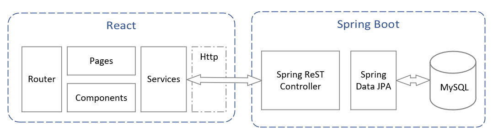
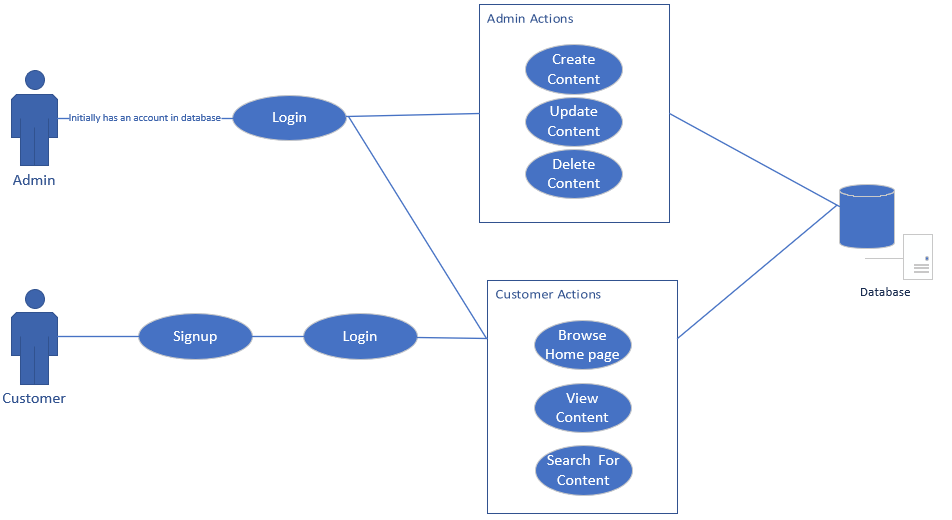
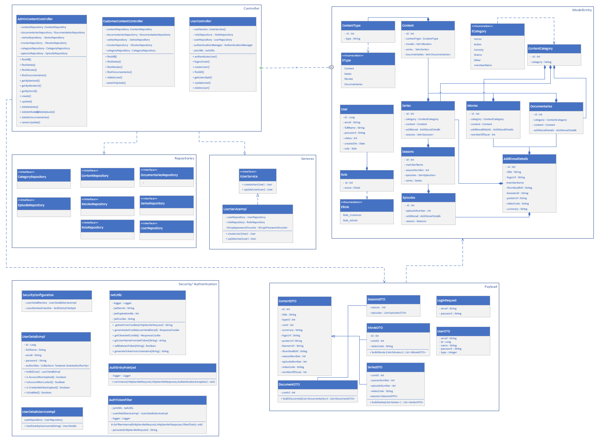
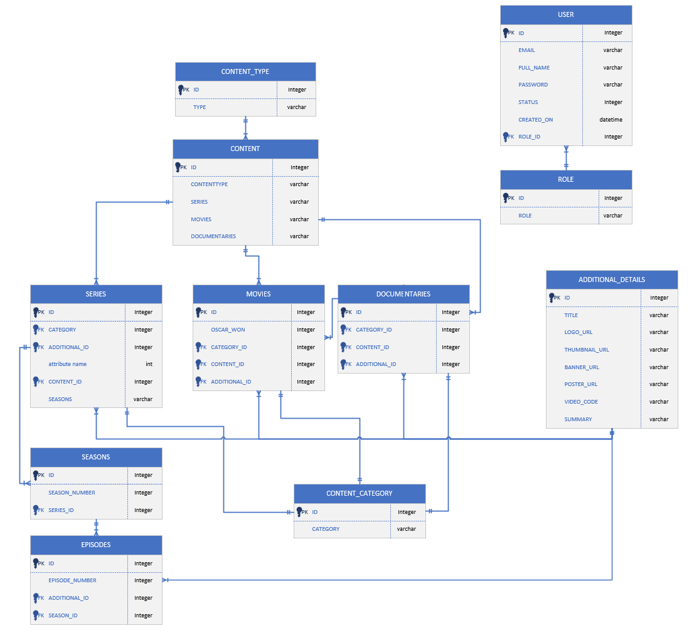

# Natflix
### Build and Generate the JAR file (compile the source code)
```
# Git clone (download the soruce code)
$ git clone https://github.com/mallikaravi/Natflix.git

# Project structure
.
├── ...
    ├──natflix-backend/
         ├──src
         ├──pom.xml
    ├──natflix-frontend/
         ├──src
         ├──package.json
    ├──sql
    ├──design/
    ├──docker-compose.yml
    ├──Dockerfile.backend
    ├──Dockerfile.frontend
    ├──README.md

$ cd Natflix
```
```
# Backend Application: Build and Run the JAR file (compile the source code)
$ cd natflix-backend
$ mvn clean package -DskipTests=true
$ java -jar -Dspring.profiles.active=prod target/natflix-backend-0.0.1.jar

# Frontenf Application : Install and run 
$ cd natflix-frontend
$ npm install
$ npm run start

NOTE:
Without Docker env: Change"proxy": "http://localhost:8080/api/" in package.json file
```
#### How to run and build in Docker 
```
$ cd Natflix
$ docker compose up --build --force-recreate
```
#### How to Setup and Access the Database, Backend and Frontend application
Note: Docker container setup the database enviroenment default data using sql/init.sql file.

- Database: 
   - User     : root
   - Password : root
   - Database Schema: natflix
   - Port : 3306
   - Initial Database schema: sql/init.sql
- Backend:
   - Profiles : prod (production environemnt) and dev (used during the development phase)
   - Server Port: 8080
   - Server Address : localhost
- Frontend:
   - Port: 3000
   - Address: localhost

Natflix Web application URL: http://localhost:3000/<br>

Login: admin@natflix.com 

Password: 12345

# Table of Contents
<!--ts-->
   * [Prerequisites](#prerequisites)
   * [About](#about)
   * [Project SetUp](#project-setup)
   * [Implementation And Design](#implementation-and-design)
        * [Architectural Diagram](#architectural-diagram)
        * [UseCase Diagram](#usecase-diagram)
        * [Class Diagram](#class-diagram) 
        * [Model Diagram](#model-diagram)
   *  [Tool Used For Project Management](#tool-used-for-project-management)
   *  [ReST API Usage](#rest-api-usage)
   *  [Future Enhancement](#future-enhancement)
      
<!--te-->
Prerequisites
============
* JDK 17.0.2
* [Maven](https://maven.apache.org/) for managing the project's build
* [Spring Boot](http://spring.io/projects/spring-boot) for creating the RESTful Web Services
* [NPM](https://docs.npmjs.com/about-npm) the package manager for the Node JavaScript platform
* [React](https://docs.retool.com/docs) for building web application.
* [Mysql](https://www.mysql.com/downloads/) as database
* [Docker](https://www.docker.com/) for building and managing the application distribution using containers
* [Postman](https://www.postman.com/downloads/) Postman is an API platform for developers to design, build, test and iterate their APIs

About
============
Natflix is  a subscription based streaming device that allows all members to watch Tv shows, series and movies.Natflix provides a frontend web page designed to meet our needs , and we shall start from it. The project is developed by React Typescript. Here we should configure our backend to communicate with the frontend to get the webpage that offers a service  to stream videos to the customers and manage the resources.The backend is developed by usingJava Springboot.There are two roles in the project.They are:

1. Admin
2. Customer

Admin can create,deleteand update the content.Customer can only view the application and play the Movies,Series or Documentaries.

Project Setup
============
The frontend is built using ReactTypescript.  
First you’ll need to setup a Springboot project for Maven to build. 

Implementation and Design
============
1. TypeScript – Coding language for implementing the Natflix Frontend Aplication
2. React -Framework for building the Graphical User Interface
3. Eclipse – IDE for backend development
4. Spring boot- Opensource Framework in Java
5. Visual Studio - IDE used for developing Frontend
6. Microsoft word – Document preparation

Explained here 

https://github.com/mallikaravi/Natflix/blob/main/design/Natflix-Documentation.pdf

Architectural Diagram
============
Architecture flow of Sprint boot application <br>
<br>
Architecture flow of Sprint boot application and React Web application <br>


Usecase Diagram
============


Class Diagram
============
<br>

Model Diagram
============


REST API Usage
============
Request Method | URI | Body (JSON) | Description |  
:---: | :--- | :---: | :--- |
POST | http://localhost:8080/api/login | {username: ""....} | Login as a admin . | 
POST | http://localhost:8080/api/signup | {username: ""....} | Registertion| 
GET | http://localhost:8080/api/logout | - | Logout and clear the cookies. | 
GET | http://localhost:8080/api/user | - | Get all the registered users | 
GET | http://localhost:8080/api/user/{id} | - | Get the details for selected user | 
PUT | http://localhost:8080/api/user/{id} | {....}  | Update User |
DELETE | http://localhost:8080/api/user/{id} | - | Remove User |
GET | http://localhost:8080/api/admin-content | - | Get all the conetent as a admin |
GET | http://localhost:8080/api/admin-content/movies | - | Get all the movies as a admin |
GET | http://localhost:8080/api/admin-content/series | - | Get all the series as a admin |
GET | http://localhost:8080/api/admin-content/documentaries | - | Get all the movies as a admin |
GET | http://localhost:8080/api/admin-details-series/{id} | - | Get series details  |
GET | http://localhost:8080/api/admin-details-movies/{id} | - | Get movie details |
GET | http://localhost:8080/api/admin-details-documentaries/{id} | - | Get documenteries details |
POST | http://localhost:8080/api/admin-content/create | {....} | Create content based on type Series/Movie/Documentaries details |
PUT | http://localhost:8080/api/admin-content/update | {....} | Get documenteries details |
DELETE | http://localhost:8080/api/"/admin-content/delete-series/{id}" | - | Delete Series |
DELETE | http://localhost:8080/api/"/admin-content/delete-episode/{id}" | - | Delete Episode |
DELETE | http://localhost:8080/api/"/admin-content/delete-movies/{id}" | - | Delete Movie |
DELETE | http://localhost:8080/api/"/admin-content/delete-documentaries/{id}" | - | Delete Movie |

Sample REST Request JSON format
=============
```
API: Content Create/Update
Body: {
    "id": 9,
    "title": "Seinfeld (pilot)",
    "type_id": 3,
    "category_id": 3,
    "summary": "Test",
    "logo_url": "",
    "poster_url": "",
    "banner_url": "",
    "thumbnail_url": "/fake-images/episodes/1.png",
    "season_number": 1,
    "episode_number": 1,
    "video_code": "A72K4M1R1tg",
    "number_of_oscars": null,
    "seasons": null
    }
     
API: User Create/Update
Body:{
    "name": "Mallika",
    "email": "mallika@gmail.com",
    "password": "12345"
}
```
Tool used for project management
============
JIRA tool is used for this project, mainly maintaining the recipe-manager application backlogs. In sort following activities are done
- EPIC
- User stories
- Sprint handling
- etc.

### Link to JIRA Activities
https://github.com/mallikaravi/Natflix/blob/main/design/Jiradashboard-Activities.pdf

Future Enhancement
============
1.  HOSTING
2.  SHOW THE WATCHED HISTORY
3. CUSTOMER OTHER AUTHS


